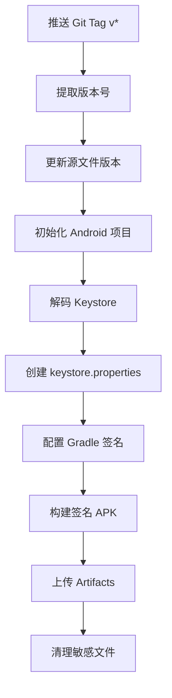

# 构建脚本说明

本目录包含用于项目构建、发布和测试的自动化脚本。

## 📁 脚本列表

### Android 签名配置

#### `configure-android-signing.py` ⭐ 推荐
**用途**: 自动配置 Android Gradle 签名设置

**功能**:
- 添加必要的 import 语句到 `build.gradle.kts`
- 在 `android {}` 块中添加 `signingConfigs`
- 在 `buildTypes.release` 中启用签名配置
- 自动检测已有配置，避免重复添加

**使用方法**:
```bash
# 前提：已运行 npx tauri android init
python3 scripts/configure-android-signing.py
```

**CI 集成**: 
- ✅ 已集成到 `.github/workflows/release.yml`
- ✅ 已集成到 `.github/workflows/build-dev.yml`

---

#### `configure-android-signing.sh`
**用途**: Bash 版本的签名配置脚本（备用）

**功能**: 与 Python 版本相同，但使用 Bash 实现

**使用方法**:
```bash
chmod +x scripts/configure-android-signing.sh
./scripts/configure-android-signing.sh
```

**注意**: Python 版本更可靠，建议优先使用

---

#### `test-android-signing.sh` 🧪
**用途**: 本地测试 Android 签名配置

**功能**:
- ✅ 检查环境变量是否设置（`secrets/.env`）
- ✅ 验证 Keystore 文件有效性
- ✅ 检查密码和 alias 是否匹配
- ✅ 显示证书信息（SHA256 指纹、有效期）
- ✅ 验证配置脚本是否存在
- ✅ 检查 Android 项目初始化状态

**使用方法**:
```bash
chmod +x scripts/test-android-signing.sh
./scripts/test-android-signing.sh
```

**输出示例**:
```
🧪 Android 签名配置测试
========================

📋 测试 1: 检查环境变量
-----------------------------------
✅ PASS: secrets/.env 文件存在
✅ PASS: ANDROID_KEYSTORE_BASE64 已设置
✅ PASS: ANDROID_KEYSTORE_PASSWORD 已设置
✅ PASS: ANDROID_KEY_ALIAS 已设置
  Alias: release
✅ PASS: ANDROID_KEY_PASSWORD 已设置

📋 测试 2: 检查 Keystore 文件
-----------------------------------
✅ PASS: Keystore Base64 解码成功
✅ PASS: Keystore 密码正确
✅ PASS: Key alias 'release' 存在

  📜 证书信息:
    Alias name: release
    Creation date: Jan 23, 2026
    Valid from: Thu Jan 23 ... until: ...
    SHA256: AB:CD:EF:...

========================
📊 测试结果汇总
========================
通过: 12
失败: 0

✅ 所有测试通过！Android 签名配置正确。
```

---

### 其他脚本

#### `check-build-ready.sh`
**用途**: Beta 构建就绪检查

**功能**:
- 检查版本号一致性（`package.json`, `Cargo.toml`, `tauri.conf.json`）
- 验证 Git 状态
- 检查必要的依赖

**使用方法**:
```bash
./scripts/check-build-ready.sh
```

---

## 🔧 CI/CD 工作流程

### Release 构建流程 (`release.yml`)



**关键步骤**:
1. **Setup Android keystore**: 解码 Base64 keystore，创建配置文件
2. **Configure Android signing**: 运行 `configure-android-signing.py`
3. **Build Android APK**: 使用签名配置构建
4. **Cleanup keystore**: 删除敏感文件

---

### Dev 构建流程 (`build-dev.yml`)

与 Release 流程类似，但：
- 版本号添加构建元数据: `0.5.2+build.123`
- Artifacts 保留 7 天（Release 保留 30 天）
- 可选的 Slack 通知

---

## 📝 本地开发工作流程

### 首次设置

1. **生成 Keystore**:
   ```bash
   keytool -genkey -v -keystore ~/upload-keystore.jks \
     -keyalg RSA -keysize 2048 -validity 10000 -alias release
   ```

2. **配置环境变量** (`secrets/.env`):
   ```bash
   ANDROID_KEYSTORE_BASE64=<base64 编码的 keystore>
   ANDROID_KEYSTORE_PASSWORD=<密码>
   ANDROID_KEY_ALIAS=release
   ANDROID_KEY_PASSWORD=<密码>
   ```

3. **测试配置**:
   ```bash
   ./scripts/test-android-signing.sh
   ```

### 本地构建签名 APK

```bash
# 1. 初始化 Android 项目
npx tauri android init

# 2. 手动创建 keystore.properties
mkdir -p src-tauri/gen/android/app
cat > src-tauri/gen/android/app/keystore.properties << EOF
keyAlias=release
keyPassword=<你的密码>
storeFile=/path/to/upload-keystore.jks
storePassword=<你的密码>
EOF

# 3. 配置签名
python3 scripts/configure-android-signing.py

# 4. 构建
npx tauri android build --target aarch64
```

### 验证签名

```bash
# 查看 APK 签名信息
apksigner verify --print-certs \
  src-tauri/gen/android/app/build/outputs/apk/universal/release/app-universal-release.apk
```

---

## 🔒 安全注意事项

### ⚠️ 不要提交到版本控制

以下文件包含敏感信息，**绝对不要**提交到 Git:

- ❌ `*.jks` (Keystore 文件)
- ❌ `keystore.properties`
- ❌ `secrets/.env` (已在 `.gitignore` 中)
- ❌ `*.pfx` (Windows 证书)

### ✅ 安全实践

1. **Keystore 备份**: 
   - 加密备份到安全位置（密码管理器、加密云存储）
   - 丢失 keystore 将无法更新已发布的应用

2. **密码管理**:
   - 使用强密码（至少 12 位，包含大小写字母、数字、符号）
   - 不要在代码或日志中硬编码密码

3. **GitHub Secrets**:
   - 定期轮换密钥（建议每年）
   - 限制 Secrets 访问权限
   - 使用环境保护规则（Environment protection rules）

4. **CI 日志**:
   - 确保密码不会出现在构建日志中
   - 使用 `echo "password=***"` 而不是直接打印

---

## 🐛 故障排查

### 问题 1: "Keystore 密码错误"

**症状**: `keytool` 或构建时报错密码不正确

**解决方案**:
```bash
# 验证密码
keytool -list -keystore upload-keystore.jks -storepass <密码>

# 如果忘记密码，需要重新生成 keystore（会导致无法更新已发布的应用）
```

---

### 问题 2: "Alias 不存在"

**症状**: 构建时找不到指定的 alias

**解决方案**:
```bash
# 查看所有 alias
keytool -list -keystore upload-keystore.jks -storepass <密码>

# 确保 ANDROID_KEY_ALIAS 与实际 alias 匹配
```

---

### 问题 3: "签名配置未生效"

**症状**: APK 使用 debug 签名而非 release 签名

**解决方案**:
```bash
# 1. 检查 build.gradle.kts 是否包含 signingConfigs
grep -A 10 "signingConfigs" src-tauri/gen/android/app/build.gradle.kts

# 2. 检查 keystore.properties 是否存在
cat src-tauri/gen/android/app/keystore.properties

# 3. 重新运行配置脚本
python3 scripts/configure-android-signing.py

# 4. 清理并重新构建
npx tauri android build --target aarch64
```

---

### 问题 4: "循环安装问题"

**症状**: APK 安装时出现循环或无法安装

**可能原因**:
1. 签名不一致（新旧版本使用不同的 keystore）
2. versionCode 未递增
3. Package ID 冲突

**解决方案**:
```bash
# 1. 完全卸载旧版本
adb uninstall com.vana.no-visitors

# 2. 清除缓存
adb shell pm clear com.android.packageinstaller

# 3. 验证新 APK 签名
apksigner verify --print-certs your-app.apk

# 4. 重新安装
adb install -r your-app.apk
```

---

## 📚 相关文档

- [DEPLOYMENT.md](../docs/DEPLOYMENT.md) - 完整的部署指南
- [VERSIONING.md](../docs/VERSIONING.md) - 版本号管理策略
- [Tauri Android 文档](https://v2.tauri.app/distribute/sign/android/)
- [Android 代码签名](https://developer.android.com/studio/publish/app-signing)

---

## 🤝 贡献

如果发现脚本问题或有改进建议，请：
1. 创建 Issue 描述问题
2. 提交 PR 并附上测试结果
3. 更新相关文档

---

**最后更新**: 2026-01-23  
**维护者**: @oneder2

